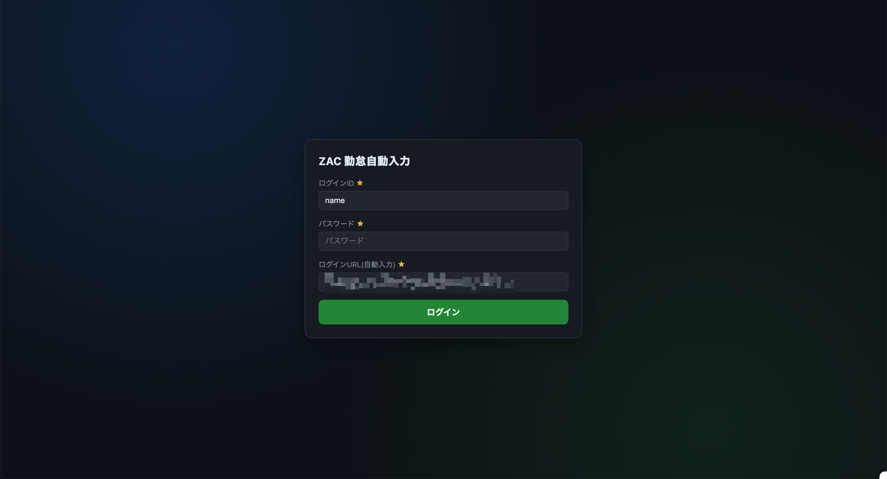
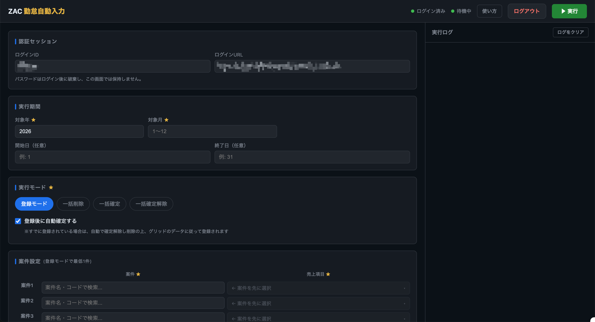
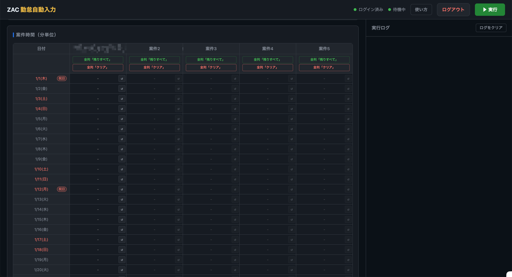

# ZAC 勤怠自動入力

ブラウザ上の設定画面から、ZAC の勤怠入力をまとめて実行するローカル向けツールです。

Docker で起動し、ZAC へのログイン、案件検索、売上項目選択、日次の分数入力、実行ログ確認までを 1 つの画面で行えます。

<table>
  <tr>
    <td></td>
    <td></td>
    <td></td>
  </tr>
</table>


## できること

- ZAC にログインしてセッションを保持
- 案件をキーワード検索して選択
- 案件ごとの売上項目を選択
- 対象月の各日に対して分単位で工数入力
- KOT 取り込み済み時間の残りを自動入力する「残りすべて」設定
- 登録モード、一括削除、一括確定、一括確定解除の実行
- 実行中ログのリアルタイム表示
- 実行完了後の確認モーダル表示

## 使う前の前提

- Docker Desktop など、Docker が使えること
- ZAC にブラウザでアクセスできること
- 社内ネットワークや VPN が必要な環境では、事前に接続済みであること

## 構築・起動方法

### ❶ `.env` の作成

- `.env.example` をコピーして `.env` を作成
- 実際のzacログインurlを見て、`.env.example`の説明通りに、`ZAC_BASE_URL`を設定する

### ❷ ツール起動

**ルートディレクトリで以下を実行します。** （2回目以降は`--build`つけなくて良い）

```bash
docker compose up --build
```

**起動後、ブラウザで以下を開きます。**

- http://localhost:5000

**停止する場合は以下です。**

```bash
docker compose down
```

## 画面の使い方

### 1. ログイン

最初にログイン画面が表示されます。以下を入力してください。

- ログインID
- パスワード
- ログインURL

通常はログインURLの初期値をそのまま使えます。組織コードや環境が異なる場合のみ変更してください。

ログインに成功すると、実行設定画面へ切り替わります。

補足:

- パスワードはログイン後に画面上から消えます
- ログインIDはブラウザの localStorage に保持されます
- セッションが切れた場合はログイン画面へ戻ります

### 2. 対象年月を入れる

以下を設定します。

- 対象年
- 対象月
- 開始日（任意）
- 終了日（任意）

開始日と終了日を入れると、対象月の一部だけを実行対象にできます。

### 3. 実行モードを選ぶ

選べるモードは以下です。

- 登録モード
   - 案件時間グリッドで入力した時間を ZAC に登録します
   - 必要に応じて「登録後に自動確定する」を ON にできます
- 一括削除
   - 対象期間中の登録済みデータを削除します
- 一括確定
   - 対象期間中の日報をまとめて確定します
- 一括確定解除
   - 対象期間中の確定済み日報をまとめて解除します

補足:

- 登録モード以外では、案件設定と案件時間入力は無効化されます

### 4. 案件設定をする

登録モードでは、最低 1 件の案件設定が必要です。

案件設定の流れ:

1. 案件欄に案件名またはコードの一部を入力
2. 候補から案件を選択
3. 売上項目欄をクリックして売上項目を選択

現在の挙動:

- 最大 5 件まで設定できます
- 案件情報はブラウザの localStorage に保持されます
- 保存済み案件はログイン後に有効性チェックされます
- 無効になっている案件は「無効」タグで表示されます
- 売上項目プルダウンは、開くたびに最新一覧を再取得します
- 案件欄右側の「×」で、その行の案件設定をまとめて消せます

### 5. 案件時間を入れる

対象年・対象月・案件設定がそろうと、案件時間グリッドが表示されます。

入力ルール:

- 分単位で入力します
- 空欄はその日の入力なしとして扱われます
- 例: 90 は 1 時間 30 分です

### 6. 「残りすべて」を使う

各セルの右側のボタン、または列ヘッダーのボタンで「残りすべて」を設定できます。

「残りすべて」とは:

- その日の KOT 取り込み済み勤務時間から、他案件に入力した分数を引いた残り分を自動で入れる設定です

使い方:

- セル右のボタンを押すと、そのセルが「残りすべて」になります
- もう一度押すと解除できます
- 列ヘッダーの「全列『残りすべて』」で、その案件列に一括設定できます
- 列ヘッダーの「全列『クリア』」で、その案件列の入力をまとめて消せます

制約:

- 1 日につき「残りすべて」を設定できるセルは 1 つだけです

### 7. 実行する

設定後、右上の「▶ 実行」を押します。

実行中は以下が行われます。

- 実行ログに進捗がリアルタイムで表示されます
- 実行中はログアウトや再実行はできません

### 8. 実行完了後

処理が終わると、画面中央に完了モーダルが表示されます。
ログインURLをそのまま開けるので、ZACにログインして表示確認、月報確定に進んでください。

## よくある使い方

### 間接工数 + 残りを実績工数に入れたい場合

例として、間接工数を先に手入力し、残りを 1 つの案件へまとめて入れたい場合は以下です。

1. 案件1に間接工数の案件と売上項目を設定
2. 各日に間接工数の分数を入力
3. 案件2に実績工数の案件と売上項目を設定
4. 案件2の列で「全列『残りすべて』」を押す

これで、案件2（メインの案件）には各日の残り時間が自動入力されるので、楽です。

## URL 設定について

画面内の「URL 設定（必要時のみ変更）」では、ZAC の各 API / 画面 URL を変更できます。

通常は初期値のままで構いません。以下のような場合だけ見直してください。

- 組織コードが異なる
- 接続先環境が異なる
- URL の構成が社内環境でカスタマイズされている

初期値は以下の設定ファイルで管理しています。

- [config/url_links.json](config/url_links.json)

このファイルで、`base_url` と `endpoints`（各URLの末尾パス）を一元管理します。

`base_url` は `{company_id}` プレースホルダーを使えます。

- 例: `https://{company_id}.zac.ai/{company_id}`

会社識別子は `.env` の `ZAC_COMPANY_ID` から読み取ります。

また、以下は上書き用途です。

- `.env` の `ZAC_BASE_URL`（最優先で上書き）

補足:

- ZAC には少なくとも複数のログインURL形式が存在するため、`会社識別子` だけの置換で必ず動くとは限りません
- このツールは標準的な `base_url + path` で構成しています
- もしログインパスやAPIパスが異なる環境の場合は、まず `config/url_links.json` の `endpoints` を修正してください
- 会社単位で接続先全体を差し替える場合は、`.env` の `ZAC_BASE_URL` を設定してください

## 保存されるもの

ブラウザの localStorage に以下が保存されます。

- ログインID
- 案件設定
   - 案件ID
   - 案件名
   - 売上項目ID
   - 検索文字列
   - 売上項目表示ラベル

保存されないもの:

- パスワード

## ログの見方

右側の実行ログには、以下が表示されます。

- ログイン処理の開始 / 成功 / 失敗
- 日ごとの登録・削除・確定・解除の進捗
- 「残りすべて」設定や解除
- エラー内容
- 処理終了

ログにエラーが出ていないかを確認してから、ZAC 側の勤怠内容を確認してください。

## トラブル時の確認ポイント

### ログインできない

以下を確認してください。

- ログインIDとパスワードが正しいか
- ログインURLが正しいか
- VPN 接続が必要な環境では接続済みか

### 案件が見つからない

以下を確認してください。

- ログイン済みか
- 対象年月が正しいか
- 案件名だけでなく案件コードでも検索しているか

### 売上項目が出てこない

以下を確認してください。

- 案件が正しく選択されているか
- 売上項目プルダウンを開き直して最新一覧を取得したか
- ZAC 側でその案件に売上項目が設定されているか

### セッションが切れた

セッション切れ時はログイン画面へ戻ります。

以下を確認してください。

- ZAC 側のセッションが失効していないか
- 長時間放置していないか
- 必要なら再ログインしてから再実行する

## セキュリティ上の前提

このツールはローカル PC でのみ使う前提です。

実装上、以下の対策を入れています。

- 公開ポートは 127.0.0.1:5000 のみ
- セッションはユーザー単位で分離
- POST API は CSRF トークンで保護
- ブラウザキャッシュを抑止
- セッション Cookie は HttpOnly / SameSite=Strict

それでも以下は守ってください。

- 外部公開しない
- 共有 PC で使う場合は利用後にブラウザを閉じる
- 不要になったら `docker compose down` で停止する

## 主な構成ファイル

- [app.py](app.py)
   - Flask アプリ本体
- [zac_runner.py](zac_runner.py)
   - Selenium による ZAC 自動操作
- [templates/index.html](templates/index.html)
   - 画面 UI とフロントエンドロジック
- [static/css/index.css](static/css/index.css)
   - UI スタイル
- [config/url_links.json](config/url_links.json)
   - URL 構成（base_url + endpoints）
- [docker-compose.yml](docker-compose.yml)
   - ローカル起動設定
- [Dockerfile](Dockerfile)
   - コンテナ定義

## 補足

- 旧来の Excel 入力ファイルは現行運用では不要です
  - `./unused`に格納
- 現在は Web 画面から直接入力する運用を前提としています
